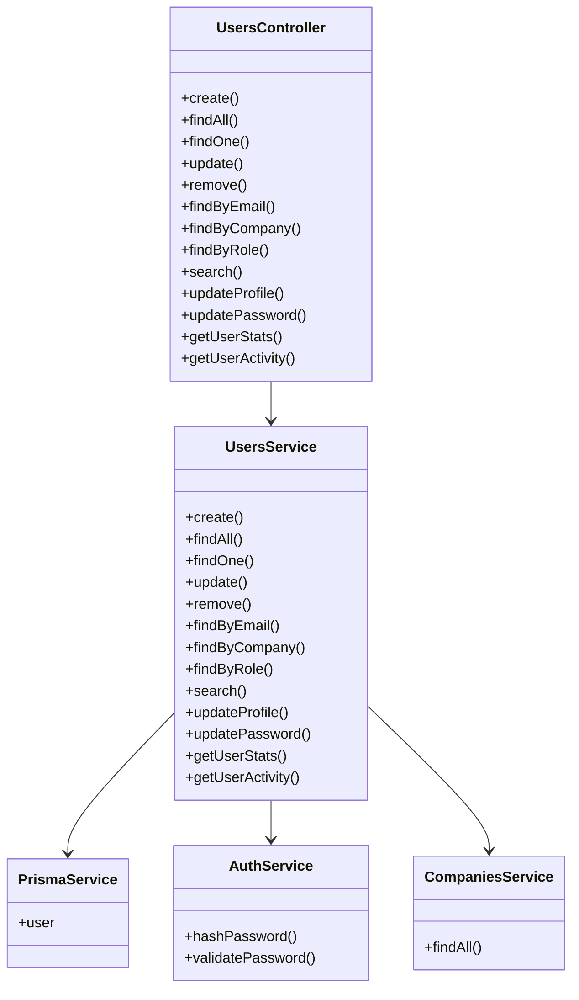
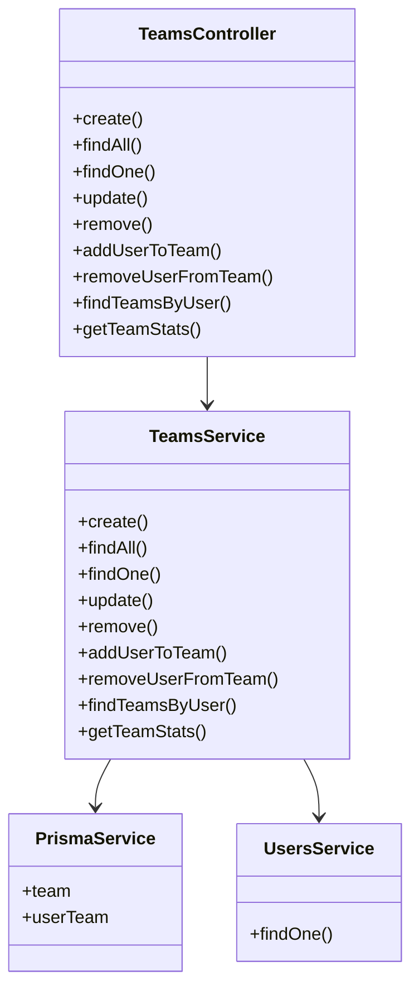
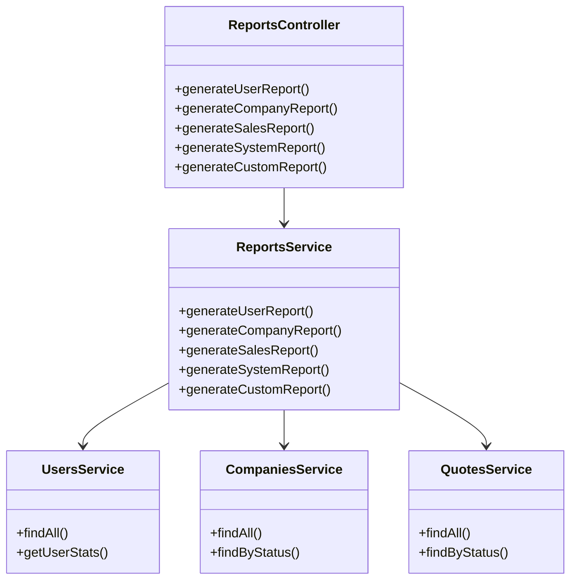
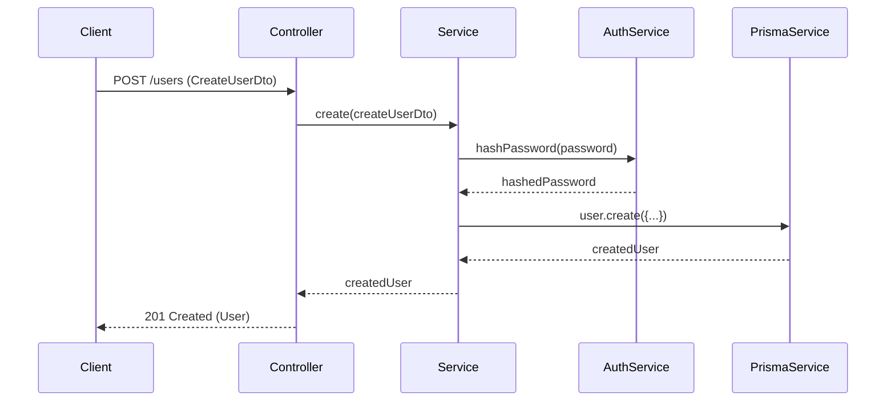
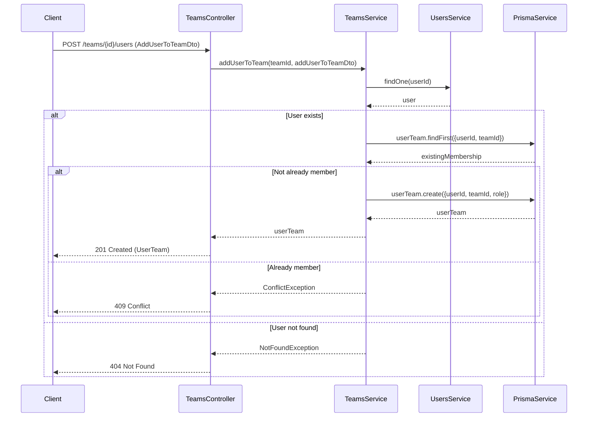
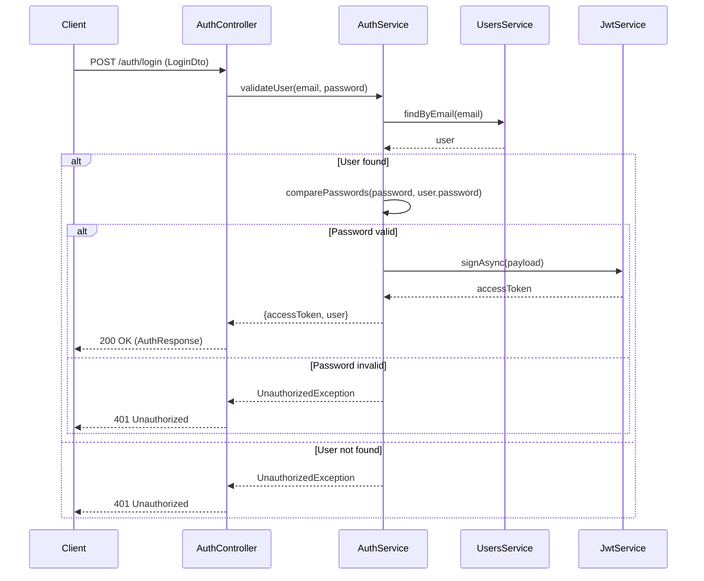
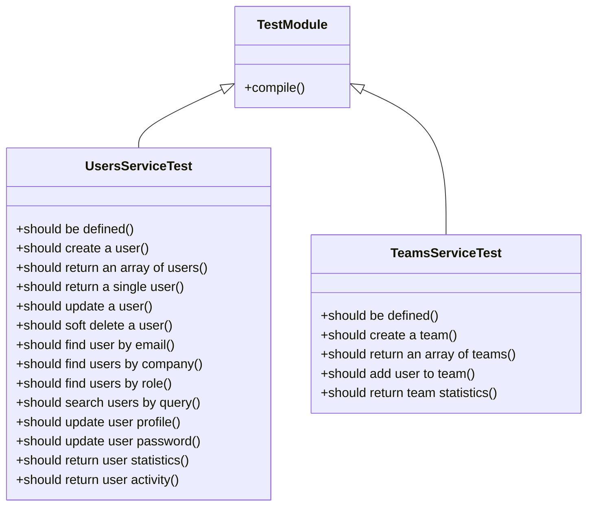
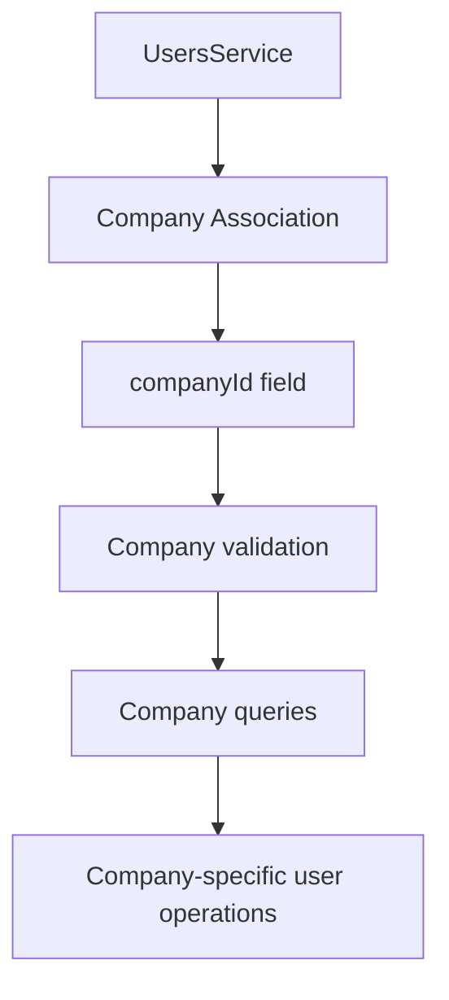
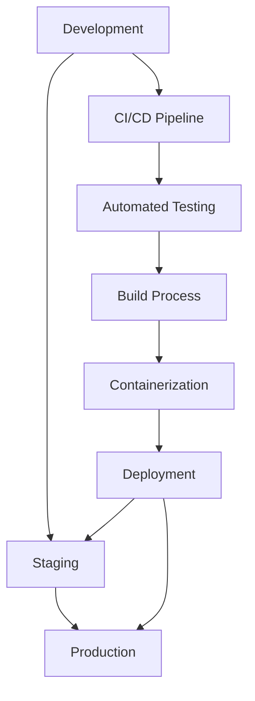

# 🏗️ User Management Architecture

## 📋 Overview

This document describes the architecture of the User Management system implemented in Sprint 4, including users, teams, and reporting modules.

## 🎯 Architecture Goals

1. **Modular Design**: Clear separation of concerns
2. **Scalability**: Designed to handle growth
3. **Maintainability**: Easy to understand and modify
4. **Security**: Robust security measures
5. **Performance**: Optimized for common operations

## 📦 Module Architecture

### 1. Users Module



### 2. Teams Module



### 3. Reports Module



## 🗃️ Database Schema

### User Table

```sql
CREATE TABLE "User" (
    "id" TEXT NOT NULL PRIMARY KEY,
    "email" TEXT NOT NULL,
    "firstName" TEXT NOT NULL,
    "lastName" TEXT NOT NULL,
    "password" TEXT NOT NULL,
    "role" TEXT NOT NULL,
    "status" TEXT NOT NULL,
    "phone" TEXT,
    "emailVerified" BOOLEAN NOT NULL DEFAULT false,
    "emailVerifiedAt" TIMESTAMP,
    "lastLoginAt" TIMESTAMP,
    "failedLoginAttempts" INTEGER NOT NULL DEFAULT 0,
    "companyId" TEXT,
    "timezone" TEXT,
    "language" TEXT,
    "lockedUntil" TIMESTAMP,
    "refreshToken" TEXT,
    "refreshTokenExpiresAt" TIMESTAMP,
    "profilePicture" TEXT,
    "dataRetentionDate" TIMESTAMP NOT NULL,
    "twoFactorEnabled" BOOLEAN NOT NULL DEFAULT false,
    "twoFactorSecret" TEXT,
    "googleId" TEXT,
    "linkedinId" TEXT,
    "dataConsentGiven" BOOLEAN NOT NULL DEFAULT false,
    "dataConsentDate" TIMESTAMP,
    "createdAt" TIMESTAMP NOT NULL DEFAULT CURRENT_TIMESTAMP,
    "updatedAt" TIMESTAMP NOT NULL DEFAULT CURRENT_TIMESTAMP,
    "deletedAt" TIMESTAMP,
    FOREIGN KEY ("companyId") REFERENCES "Company"("id") ON DELETE SET NULL
);
```

### Team Table

```sql
CREATE TABLE "Team" (
    "id" TEXT NOT NULL PRIMARY KEY,
    "name" TEXT NOT NULL,
    "description" TEXT,
    "createdAt" TIMESTAMP NOT NULL DEFAULT CURRENT_TIMESTAMP,
    "updatedAt" TIMESTAMP NOT NULL DEFAULT CURRENT_TIMESTAMP,
    "deletedAt" TIMESTAMP
);
```

### UserTeam Table (Join Table)

```sql
CREATE TABLE "UserTeam" (
    "userId" TEXT NOT NULL,
    "teamId" TEXT NOT NULL,
    "role" TEXT NOT NULL,
    "joinedAt" TIMESTAMP NOT NULL DEFAULT CURRENT_TIMESTAMP,
    PRIMARY KEY ("userId", "teamId"),
    FOREIGN KEY ("userId") REFERENCES "User"("id") ON DELETE CASCADE,
    FOREIGN KEY ("teamId") REFERENCES "Team"("id") ON DELETE CASCADE
);
```

## 🔄 Data Flow

### User Creation Flow



### Team User Assignment Flow



## 📊 Reporting Architecture

```mermaid
flowchart TD
    A[Client Request] --> B[ReportsController]
    B --> C[ReportsService]
    C --> D[UsersService.getUserStats()]
    C --> E[CompaniesService.findAll()]
    C --> F[QuotesService.findAll()]
    D --> G[User Statistics]
    E --> H[Company Data]
    F --> I[Sales Data]
    G --> J[Report Aggregation]
    H --> J
    I --> J
    J --> K[Report Generation]
    K --> L[Response Formatting]
    L --> M[Client Response]
```

## 🔒 Security Architecture

### Authentication Flow



## 🧪 Testing Architecture



## 📈 Performance Considerations

1. **Database Indexing**: Proper indexing on frequently queried fields
2. **Caching**: Potential caching for user statistics and reports
3. **Batch Operations**: Support for bulk user operations
4. **Pagination**: All list endpoints support pagination
5. **Query Optimization**: Efficient database queries

## 🔄 Integration Points

### Dashboard Integration

```mermaid
flowchart TD
    A[DashboardController] --> B[DashboardService.getMetrics()]
    B --> C[UsersService.getUserStats()]
    B --> D[CompaniesService.count()]
    B --> E[ContactsService.count()]
    B --> F[QuotesService.count()]
    C --> G[User Statistics]
    D --> H[Company Count]
    E --> I[Contact Count]
    F --> J[Quote Count]
    G --> K[Metrics Aggregation]
    H --> K
    I --> K
    J --> K
    K --> L[Dashboard Data]
```

### Company Integration



## 📝 API Documentation

All endpoints are documented with Swagger/OpenAPI:

```typescript
@ApiTags('users')
@ApiBearerAuth()
@Controller('users')
export class UsersController {
  @Post()
  @ApiOperation({ summary: 'Create a new user' })
  @ApiResponse({ status: 201, description: 'User created successfully' })
  @ApiResponse({ status: 400, description: 'Bad request' })
  async create(@Body() createUserDto: CreateUserDto) {
    // Implementation
  }
}
```

## 🚀 Deployment Architecture



This architecture document provides a comprehensive overview of the User Management system's design, data flow, security measures, and integration points, serving as a reference for developers and architects.